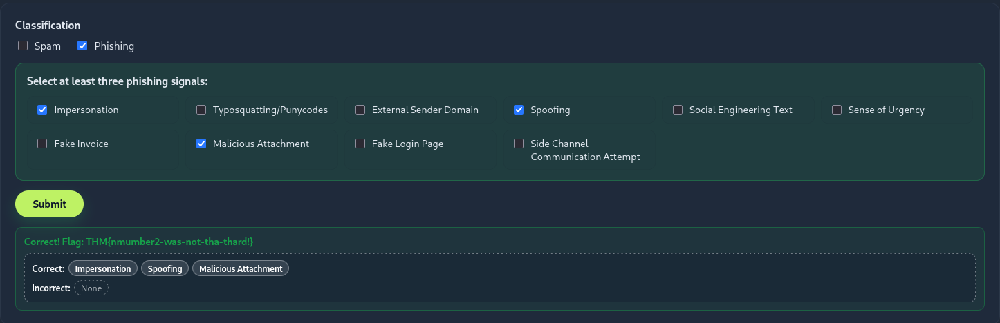
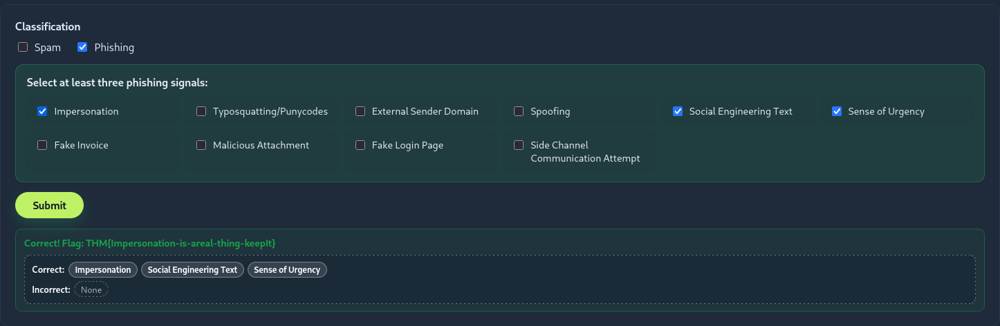
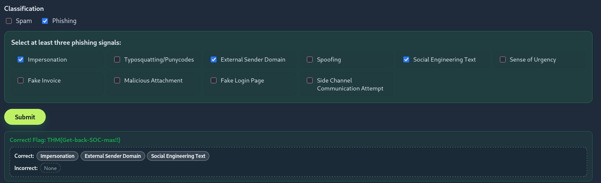
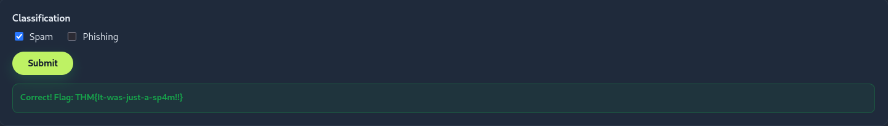
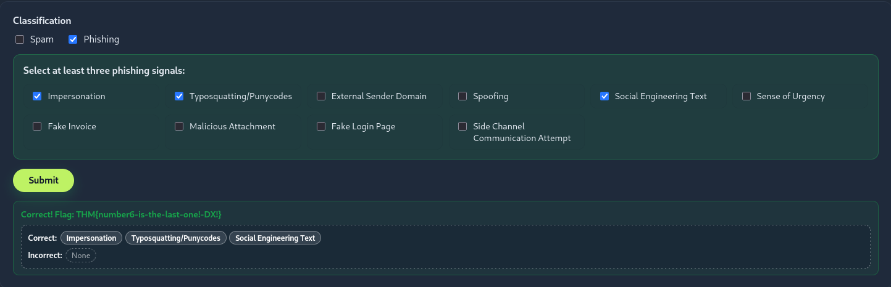

# TryHackMe - Spotting Phishing (AoC 2025)

**Room:** [Spotting Phishing](https://tryhackme.com/room/spottingphishing-aoc2025-r2g4f6s8l0)  
**Category:** Phishing Analysis / Email Security  
**Difficulty:** Easy  

---

## 🎯 Objective

Analyse six emails and classify each one as either **Spam** or **Phishing**. For phishing emails, identify at least three phishing signals from the following list:

| Signal | Description |
|--------|-------------|
| Impersonation | Sender pretends to be a legitimate entity |
| Typosquatting/Punycodes | Domain looks similar to a real one but is slightly altered |
| External Sender Domain | Email originates from outside the expected domain |
| Spoofing | Sender address is forged to appear legitimate |
| Social Engineering Text | Manipulative language designed to trick the user |
| Sense of Urgency | Pressures recipient to act quickly |
| Fake Invoice | Contains a fraudulent billing document |
| Malicious Attachment | File attached with intent to harm |
| Fake Login Page | Link redirects to a credential-harvesting page |
| Side Channel Communication Attempt | Tries to move conversation outside official channels |

---

## 📧 Email Analysis

### Email 1 - Invoice from Santa Claus (4103)

.png)

**Classification:** Phishing

**Identified Signals:**

| # | Signal | Reasoning |
|---|--------|-----------|
| 1 | **Spoofing** | Sender address was forged to appear trustworthy |
| 2 | **Sense of Urgency** | Email pressured the recipient to act immediately |
| 3 | **Fake Invoice** | Contained a fraudulent invoice document |

**Flag:** `THM{yougotnumber1-keep-it-going}`

---

### Email 2 - New Audio Message from McSkidy

**Classification:** Phishing

**Identified Signals:**

| # | Signal | Reasoning |
|---|--------|-----------|
| 1 | **Impersonation** | Attacker posed as a known/trusted party |
| 2 | **Spoofing** | Sender address was falsified |
| 3 | **Malicious Attachment** | Email included a dangerous file attachment |

**Flag:** `THM{nmumber2-was-not-tha-thard!}`

---

### Email 3 - URGENT  McSkidy VPN access for incident response

**Classification:** Phishing

**Identified Signals:**

| # | Signal | Reasoning |
|---|--------|-----------|
| 1 | **Impersonation** | Attacker disguised themselves as a legitimate contact |
| 2 | **Social Engineering Text** | Body text was crafted to psychologically manipulate the reader |
| 3 | **Sense of Urgency** | Forced a rushed response from the recipient |

**Flag:** `THM{Impersonation-is-areal-thing-keepIt}`

---

### Email 4 - TBFC HR Department shared Annual Salary Raise Approval.pdf with you

**Classification:** Phishing

**Identified Signals:**

| # | Signal | Reasoning |
|---|--------|-----------|
| 1 | **Impersonation** | Sender posed as a trusted individual or organisation |
| 2 | **External Sender Domain** | Email was sent from a domain outside the expected organisation |
| 3 | **Social Engineering Text** | Used persuasive/deceptive language to trick the recipient |

**Flag:** `THM{Get-back-SOC-mas!!}`

---

### Email 5 - Improve your event logistics this SOC mas season

**Classification:** ✉️ Spam (Not Phishing)

**Reasoning:**  
This email did not exhibit phishing characteristics. It was unsolicited bulk/promotional content — no credential harvesting, no malicious attachments, no spoofing or impersonation detected. It was classified simply as **Spam**.

**Flag:** `THM{It-was-just-a-sp4m!!}`

---

### Email 6 - TBFC IT shared Christmas Laptop Upgrade Agreement with you

**Classification:** Phishing

**Identified Signals:**

| # | Signal | Reasoning |
|---|--------|-----------|
| 1 | **Impersonation** | Attacker posed as a legitimate entity |
| 2 | **Typosquatting/Punycodes** | Domain used slight character variations to mimic a real domain |
| 3 | **Social Engineering Text** | Manipulative language used to deceive the recipient |

**Flag:** `THM{number6-is-the-last-one!-DX!}`

---

## 🚩 Flags Summary

| Email | Classification | Phishing Signals | Flag |
|-------|---------------|-----------------|------|
| 1 | Phishing | Spoofing, Sense of Urgency, Fake Invoice | `THM{yougotnumber1-keep-it-going}` |
| 2 | Phishing | Impersonation, Spoofing, Malicious Attachment | `THM{nmumber2-was-not-tha-thard!}` |
| 3 | Phishing | Impersonation, Social Engineering Text, Sense of Urgency | `THM{Impersonation-is-areal-thing-keepIt}` |
| 4 | Phishing | Impersonation, External Sender Domain, Social Engineering Text | `THM{Get-back-SOC-mas!!}` |
| 5 | Spam | - | `THM{It-was-just-a-sp4m!!}` |
| 6 | Phishing | Impersonation, Typosquatting/Punycodes, Social Engineering Text | `THM{number6-is-the-last-one!-DX!}` |

---

## 🧠 Key Takeaways

### Phishing vs Spam
- **Spam** = unsolicited bulk email, usually commercial - annoying but not inherently malicious.
- **Phishing** = deceptive email with malicious intent (steal credentials, deliver malware, etc.).

### Most Common Signals Observed
- **Impersonation** appeared in 4 out of 5 phishing emails - attackers almost always pretend to be someone you trust.
- **Social Engineering Text** was present in 3 emails - urgency and fear are classic manipulation tools.
- **Spoofing** was used to make the sender address look legitimate at a glance.

### Analyst Tips
1. Always check the **sender domain** - a real bank won't email from `@gmail.com`.
2. Hover over links **before** clicking - fake login pages often use domains that look close but aren't exact.
3. Attachments from unexpected senders = automatic red flag, even if the email looks legitimate.
4. **Urgency is a weapon** - if an email is pressuring you to act *right now*, slow down and verify.
5. Typosquatting is subtle - `paypa1.com` vs `paypal.com` can be easy to miss at a glance.
